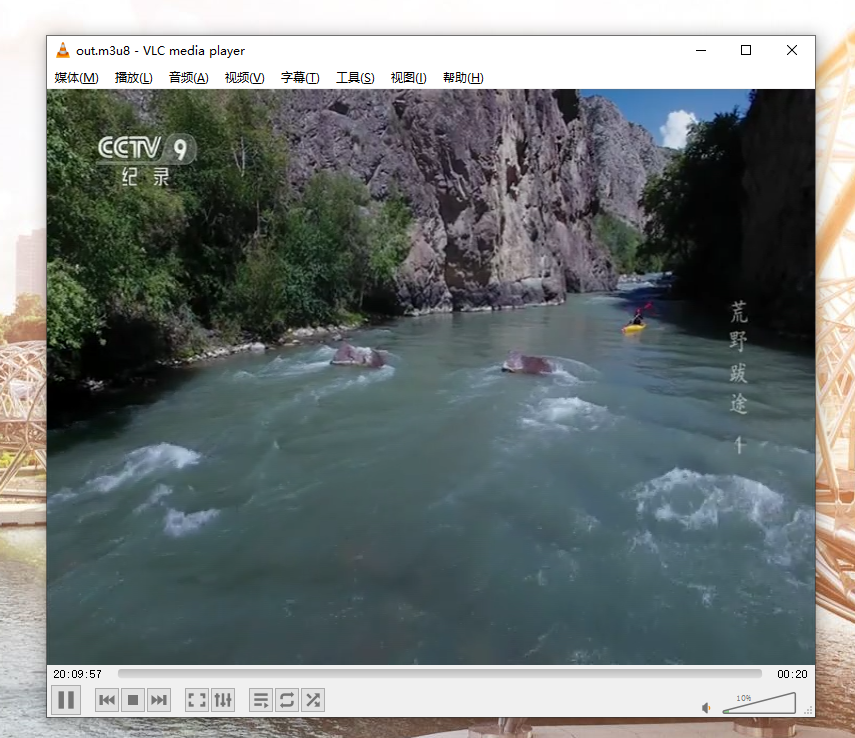

# go_ffmpeg
尝试直接调用 ffmpeg 动态库函数,生成 hls 文件. 目前支持 windows 环境， 其他环境需要自行安装相关依赖库

##### 参考资料
[https://github.com/leandromoreira/ffmpeg-libav-tutorial#learn-ffmpeg-libav-the-hard-way](https://github.com/leandromoreira/ffmpeg-libav-tutorial#learn-ffmpeg-libav-the-hard-way)

##### 使用方法
- 复制所有 dll 到项目根目录下
- example
```go
package main

import "github.com/snowlyg/go_ffmpeg"

func main() {
	hls := go_ffmpeg.Hls{
		InFilename: "rtsp://www.mym9.com/101065?from=2019-06-28/01:12:13",
		OutFilename: "./hls_files",
	}

	hls.ToHls()
}   

```

#### `ffmpeg` 推流 
- 因为资源地址是电信地址，移动宽带可能d会出现无法播放的情况。
- 通过 `cgo` 直接调用 `ffmpeg C++ Api` 的方式实现转码视频流,生成 `.m3u8` 文件到 `hls` 目录下。
- 配置文件增加了 `recordpath: D:\Env\nginx\html\hls\cctv1` 选项，需要配置绝对路径
- 启动项目后将地址 `http://127.0.0.1:8085/record/out.m3u8` 在 `vlc` 播放器打开即可播放中央9台。

#### 配置 `ffmpeg api` 库支持,增加系统变量
- 需要安装 `pkg-config`。 [windows pkg-config 环境下载地址](https://www.jianshu.com/p/d060030ef2a2), `mac/linux` 直接命令安装即可。

- `windows` 环境：可以到 [github.com/snowlyg/ffmpegTest](github.com/snowlyg/ffmpegTest) 复制相关依赖步骤如下：
- 配置 PKG_CONFIG_PATH 系统变量，复制 lib/include 目录到环境变量配置的路径中。
- 复制项目根目录下的 `.pc` 文件到 `PKG_CONFIG_PATH` 路径中，将里面 lib 和 include 目录路径修改为你的 `PKG_CONFIG_PATH` 路径。
- 最后还需要把 `dll` 目录下的所有 `dll` 文件复制到项目目录下。 

- `mac/linux` 环境：请配置系统变量
```shell script
export CGO_LDFLAGS="-L/usr/local/Cellar/ffmpeg/4.3_1/lib/ -lavcodec -lavformat -lavutil -lswscale -lswresample -lavdevice -lavfilter"
export CGO_CFLAGS="-I/usr/local/Cellar/ffmpeg/4.3_1/include"

```

```shell script
# rpm for centos7
# https://rpmfind.net/linux/rpm2html/search.php?query=ffmpeg-devel
# https://centos.pkgs.org/7/okey-x86_64/ffmpeg-devel-3.2.4-1.el7.centos.x86_64.rpm.html
# http://ftp.pbone.net/mirror/ftp5.gwdg.de/pub/opensuse/repositories/home:/SocMinarch:/ffmpeg/CentOS_7/x86_64/
# https://linuxize.com/post/how-to-install-ffmpeg-on-centos-7/

sudo apt-get -y install autoconf automake build-essential libass-dev libfreetype6-dev libsdl1.2-dev libtheora-dev libtool libva-dev libvdpau-dev libvorbis-dev libxcb1-dev libxcb-shm0-dev libxcb-xfixes0-dev pkg-config texi2html zlib1g-dev

sudo apt install -y libavdevice-dev libavfilter-dev libswscale-dev libavcodec-dev libavformat-dev libswresample-dev libavutil-dev

sudo apt-get install yasm

export FFMPEG_ROOT=$HOME/ffmpeg
export CGO_LDFLAGS="-L$FFMPEG_ROOT/lib/ -lavcodec -lavformat -lavutil -lswscale -lswresample -lavdevice -lavfilter"
export CGO_CFLAGS="-I$FFMPEG_ROOT/include"
export LD_LIBRARY_PATH="$FFMPEG_ROOT/lib"
```



